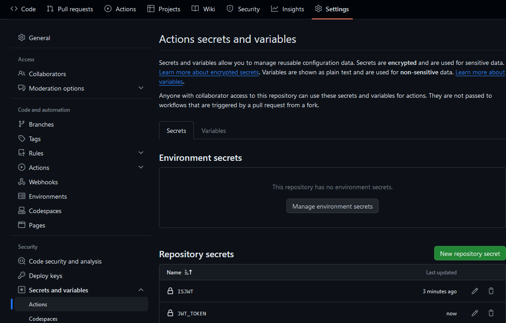

# HoneygainAutoClaim  

[](https://github.com/MrLoLf/HoneygainAutoClaim/actions/workflows/github-code-scanning/codeql)
  
HoneygainAutoClaim is a 🐍 [Python](https://www.python.org/) script (bot) that **automatically claims your daily bonus** and **achievements** 
from 🐝 [Honeygain](https://r.honeygain.me/ROSCH76C7D) 🍯.  
Honeygain is a service that allows you to 💵 earn **passive income** by **sharing** your **internet** connection with 
others.  
  
## Disclaimer  
  
This script is **not** affiliated with or endorsed by Honeygain. Use it at your **own risk** and responsibility.  
The **author** is **not responsible** for any consequences that may arise from using this script. If Honeygain wants me 
to delete this bot, I'll do it.
  
## License  

This project is licensed under the [MIT License](https://mit-license.org/). For more information, see the 
[LICENSE file](./LICENSE).  

___

## List of Content  
  
- [Installation/Usage](#usage)  
- [Creating a schedule](#create-a-schedule)  
- [Config changes](#config)  
- [Change logging behavior](#logging)
  
## Requirements

- [🐍 Python 3.10 or higher](https://www.python.org/downloads/)
- [🐝 Honeygain account](https://r.honeygain.me/ROSCH76C7D)
  
  
## <a name='usage'></a>Usage  

### 🪟 Windows / 🐧 Linux  

- **Clone** or **download** this repository.
  ```commandline
  git clone https://github.com/MrLoLf/HoneygainAutoClaim.git
  ```
- Navigate in to the directory `HoneygainAutoClaim`
  ```commandline
  cd HoneygainAutoClaim
  ```
- Install the **required** modules with  
  ```commandline  
  python3 -m pip install -r requirements.txt  
  ```  
- If you run the cron job, it's recommended to navigate back to your home directory with:
  ```commandline
  cd ~
  ```
- Run the script with  
  ```commandline  
  python3 /absolut folder path/main.py  
  ```  
- [Create a schedule](#schedule-linux) to run the program every day.  
- Enjoy your **daily bonus**!  

### 🐙 GitHub Actions  

#### Benefits  

- Run w/o PC, VPS, On the fly
- Keep your email, password or your token safe with env secret from GitHub
- Automatically run everyday

### Usage 
### Use JWT Token

  1. Go to your Honeygain Dashboard or click [here](https://dashboard.honeygain.com/) and log in to your Honeygain account
  2. Open the browser's console by pressing `F12` button ( or `Fn+F12` on some laptops )
  3. Click on the tab `Application` than click to `Local storage` and click to `https://dashboard.honeygain.com`; then you will see key `JWT` that includes your token, copy this for next steps
  4. [Fork this repository 🍴](https://github.com/MrLoLf/HoneygainAutoClaim/fork)
  5. Go to your forked repository 🍴
  6. Go to `Settings > Secrets and Variables > Actions`, and click `New Repository secret`
  7. Use `JWT_TOKEN` and paste your JWT Token from Steps 3. Create another secret and use `IsJWT` set to `true`.
  8. Go to your forked repository 🍴 and go to the Actions tab and press `I understand my workflows, go ahead and enable them`

<p align="left">
  
  
</p>

### Use Mail and Password

  1. [Fork this repository 🍴](https://github.com/MrLoLf/HoneygainAutoClaim/fork)
  2. Go to your forked repository 🍴
  3. Go to `Settings > Secrets and Variables > Actions`, and click `New Repository secret`
  4. For the secret name, use `MAIL` and set your Honeygain email and `PASS` for your password and `IsJWT` set to `false`.
  5. Go to your forked repository 🍴 and go to the Actions tab and press `I understand my workflows, go ahead and enable them`

<p align="left">
  
</p>


### 🐋 Docker  

- **Clone** or **download** this repository.
  ```commandline
  git clone https://github.com/MrLoLf/HoneygainAutoClaim.git
  ```
  or use the **docker image** from docker hub
  ```commandline
  docker pull mrlolf/honeygainautoclaim:latest
  ```
- Navigate in to the directory `HoneygainAutoClaim` this isn't needed if the image was used
  ```commandline
  cd HoneygainAutoClaim
  ```  
- To build the Dockerfile, run the command below (this can be **skipped** if the **image** was used):  
  ```commandline  
  docker build -t honeygainautoclaim .
  ```  
- To build it for arm64 like a raspberry pi run this command:
  ```commandline
  docker buildx build --platform linux/arm64 -t honeygainautoclaim .
  ```
- To run the docker container use on of the commands below. 
  When using the **image** simply **add** in front of honeygainautoclaim **mrlolf/** it should **look like this** `mrlolf/honeygainautoclaim` 
  ```commandline  
  docker run -it  honeygainautoclaim  
  ```
  or run it without the interactive menu
  ```commandline
  docker run -e MAIL="your@email.here" -e PASS="PASSWORD" honeygainautoclaim
  ```
  or just with the token
  ```commandline
  docker run -e JWT_TOKEN="YOURTOKEN" honeygainautoclaim
  ```
- [Create a schedule](#schedule-docker) to run the program every day.  
- Enjoy your **daily bonus**!  
  
### <a name='create-a-schedule'></a> 🕑 Create a schedule

#### <a name=github-actions></a> 🐙 GitHub Actions  

- Well, GitHub uses UTC time (UTC + 0) for scheduling workflows, so we should convert it to our timezone.

- For example: If I want to set the daily trigger to trigger at 9:00 PM (UTC + 7), I have to set it to 2:00 PM or 14:00 
(24-hour format) (UTC ± 0) (2 + 7 = 9).

  ```
  name: Daily claim
  on:
    schedule:
      - cron: '0 14 * * *' # <- Use UTC Time +0 , change your time here ( 14 is hour , 0 is minutes ) and use 24-hour format
  ```
- So, if I want the daily trigger to run at 5:00 AM (UTC + 7), I have to set it to 10:00 PM (UTC ± 0) (use 24-hour 
format):
  ```
  name: Daily claim
  on:
    schedule:
      - cron: '0 22 * * *' # <- Use UTC Time +0 , change your time here ( 14 is hour , 0 is minutes ) and use 24-hour format
  ```
  
#### <a name='schedule-linux'></a> 🐧 Linux  
  
1. ```commandline
   crontab -e  
   ```  
2. Add this line at the **bottom** `0 8 * * * python3 /absolut folder path/main.py` to run the script every day at 8:00 
am.  
  
#### <a name='schedule-docker'></a> 🐋 Docker 
  

  
1. You can find the docker container ID by running  
    ```commandline  
    docker ps -a  
    ```
2. ```commandline  
   crontab -e  
   ```  
   Or the windows equivalent via the Task Scheduler.  
3. Add this line at the **bottom**   `0 8 * * * docker start <container_id>`. 
   Make sure to replace <container_id> with the ID of your Docker container.
   
  
#### 🪟 Windows  

1. Open Task Scheduler.
2. Click on Create Task.
3. Enter task name: `HoneygainAutoClaim`.
4. Switch to Triggers tab.
5. Click on New.
6. Select On a schedule.
7. Set start date to today, time to 8:00 AM.
8. Select Daily in Settings.
9. Click on OK.
10. Switch to Actions tab.
11. Click on New.
12. Select Start a program.
13. Enter path to Python executable, e.g. `C:\Python39\python.exe`.
14. Enter path to, e.g. `C:\HoneygainAutoClaim\main.py` script to `Add arguments`.
15. Click on OK.
  
## <a name='config'></a>Config  
  
### 🪟 Windows  
  
- Open the folder where the main.py is being located  
- Navigate in to Config  
- Open the file `HoneygainConfig.toml`  
  
### 🐧 Linux  
  
- ```commandline
  nano /absoulut folder path/HoneygainAutoClaim/Config/HoneygainConfig.toml
  ```
## <a name='logging'></a>Change logging behavior
  
### Disclaimer  
Only do this if you know what you are doing. You can break the program and logging with changes made here.
  
### Usage  
- Open `main.py`
- Edit this line
  ```python 
    logging.basicConfig(filename='Logs/HoneygainAutoClaim.log', filemode='w', encoding='utf-8', level=logging.INFO,
                        format='%(levelname)s ' '%(asctime)s ' '%(message)s', datefmt='%d/%m/%Y %H:%M:%S') 
  ```
- If you want to keep your old logs you can change the filemode from `w` to `a` it uses the default python filemodes.  
  By changing this be sure to clean your log sometimes because it can get very large and use a lot of space.
- To change the logging level simple change INFO to WARN or ERROR
- If you want to change the format you can remove the time for example by removing `%(asctime)s`
- To change the time that's being shown change the datefmt
